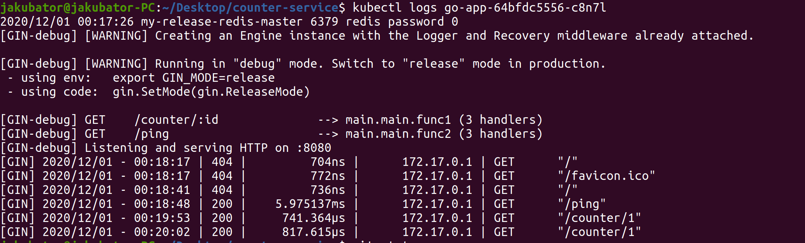
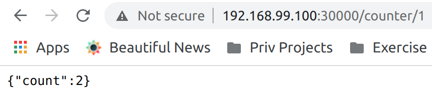

#High level Architecture and deployment information:

##Application deployed using minikube kubernetes cluster using:
* secrets for Redis
* configmap
* a redis cluster using helm
* an app-deployment.yaml
* a service that exposes the app (NodePort)

##Deployment:
* 2 instances of our GO web application.
* a load balancer that balances the load on our two web application instances.
* a redis cluster with a master-slave replication.

##Deployment/Installation Steps steps
1. Copy and unpack the "counter-service.zip" package to the Fresh VM
2. run: $ bash ./run-me.sh
	1. This should install all the dependencies and tools needed to run the service
		1. I couldn't test this step in 100% due to virtualization problems on my PC 
3. Start the minikube service with the following command:
	1. $ minikube service go-app-service

Checking the service from you local browser at:
* MiniKubeIP:30000/ping
* MiniKubeIP:30000/counter/1

##Screenshots of the working app:

